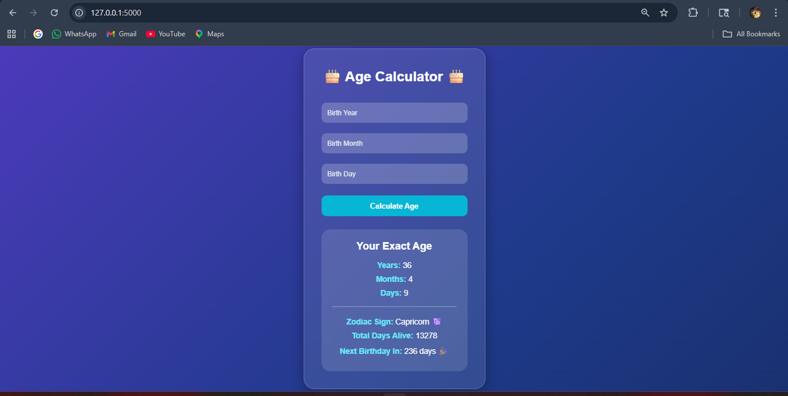

# 🎂 Age Calculator App

A simple and modern Age Calculator built using Python and Tkinter.

## ✨ Features

- Calculate exact age
- Shows years, months, and days
- Beautiful GUI using Tkinter
- Invalid date handling
- Future date validation
- Easy-to-use interface

---

## 📸 Screenshot



---

## 🛠 Technologies Used

- Python
- Tkinter
- Datetime
- Rich (for terminal version)

---

## 📦 Installation

Clone the repository:

```bash
git clone https://github.com/yourusername/age-calculator.git
```

Go to project folder:

```bash
cd age-calculator
```

Install dependencies:

```bash
pip install -r requirements.txt
```

Run the app:

```bash
python age_gui.py
```

---

## 📁 Project Structure

```text
age-calculator/
│
├── age_gui.py
├── requirements.txt
├── README.md
└── screenshot.png
```

---

## 🚀 Future Improvements

- Dark/Light mode
- Calendar date picker
- Zodiac sign finder
- Birthday countdown
- Export results
- Modern CustomTkinter UI

---

## 👨‍💻 Author

Made by Ujjwal Ayush